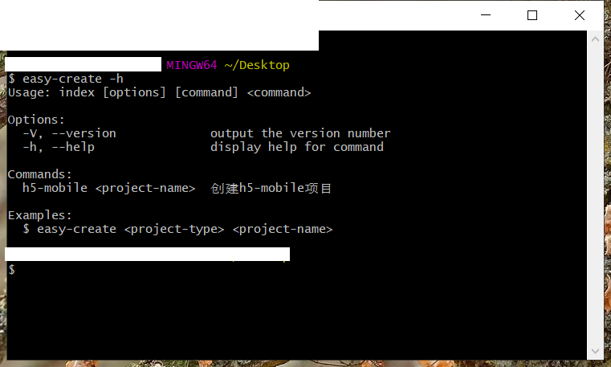
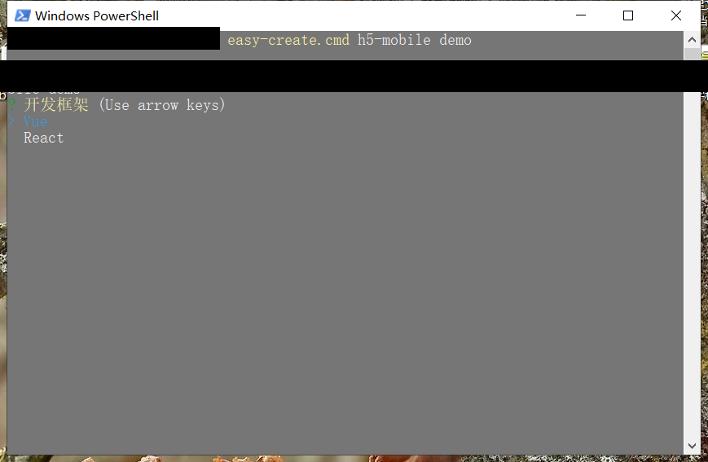
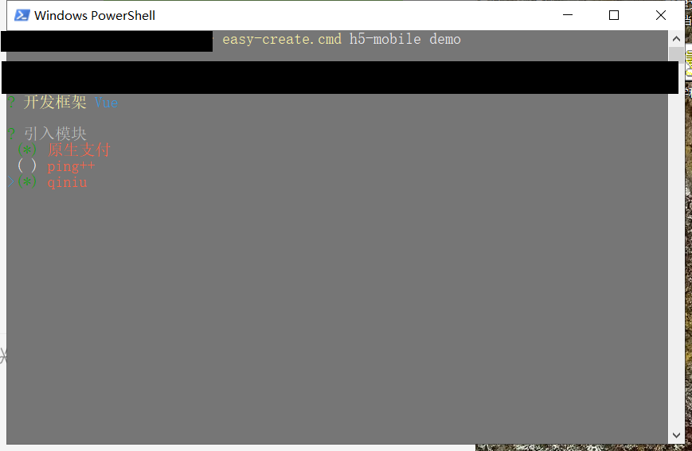
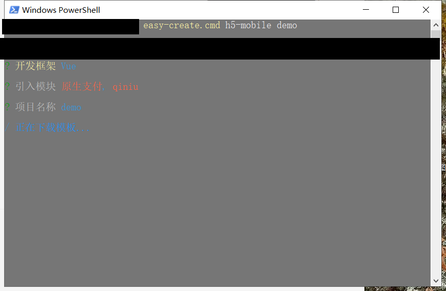
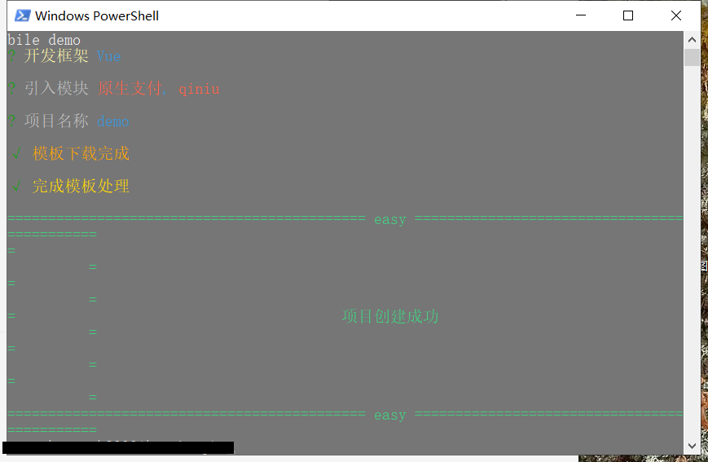

# easy-create-cli
简易项目生成脚手架工具

# 安装
```
git clone https://github.com/DavidWong9785/easy-create-cli.git

cnpm i
```

#初始化
```
npm run init-set
```

# 配置命令
```
// 找到 config/commandConfig.js，并配置相应命令
module.exports = {
	// 版本信息
    version: '0.1.0',
	// 帮助提示
    help: ['', 'Examples:', '  $ easy-create <project-type> <project-name>'],
	// 命令配置
    list: [{
		// 命令名称 - 必传参数
        name: 'h5-mobile',
		// 命令描述 - 必传参数
        desc: '创建h5-mobile项目',
        // git地址 - 必传参数
        git: 'https://github.com/DavidWong9785/easy-create-template.git',
        // branch 分支，非必传，可在action返回
        // branch: 'h5-mobile-vue',
        /**
         * commandInfo 当前命令配置信息 - (name, desc, git, branch...)
         * inputArgs 命令行输入参数 - Array
         * options 选择项信息
         */
        action: (commandInfo, inputArgs, options) => {
            const lib = options.lib === 1 ? 'vue' : 'react'
            return {
                branch: `${commandInfo.name}-${lib}`
            }
        }
    }]
}
```


# 配置参数
```
// 找到 config/optionConfig.js，并配置相应参数
const chalk = require('../util/chalk-extends')
module.exports = {
	// 命令参数
    'h5-mobile': [
		// 单选
        [
            {
                type: 'list',
                name: 'lib',
                message: '开发框架',
                choices: [{ name: 'Vue', value: 1 }, { name: 'React', value: 2 }]
            }
        ],
		// 多选
        [
            {
                type: 'checkbox',
                name: 'module',
                message: chalk.SILVER('引入模块'),
                choices: [
                    { name: chalk.TOMATO('原生支付'), value: 'origin-pay' },
                    { name: chalk.TOMATO('其他支付'), value: 'other' },
                ],
            }
        ],
		// 输入
        [
            {
                type: 'input',
                name: 'projectName',
                message: chalk.SILVER('项目名称'),
            }
        ]
    ],
}
```




